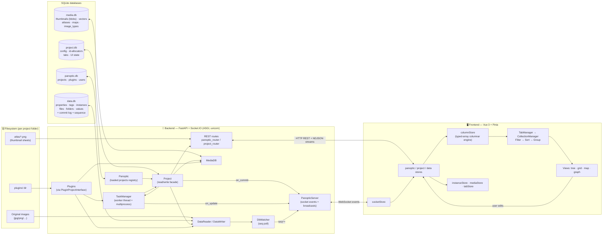
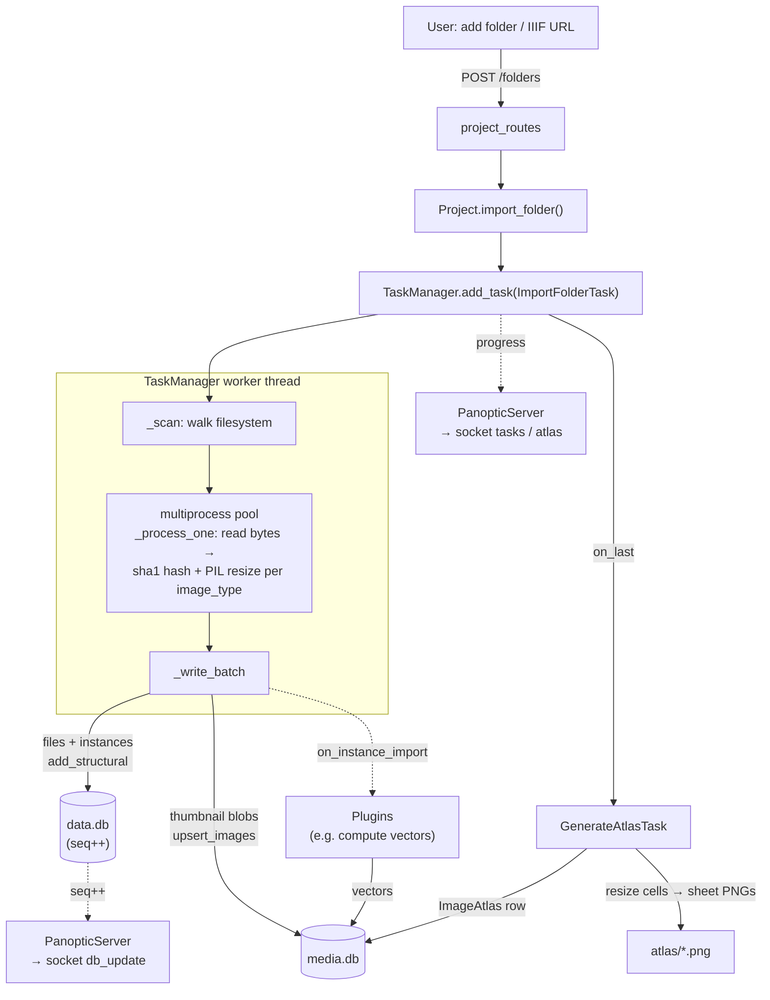
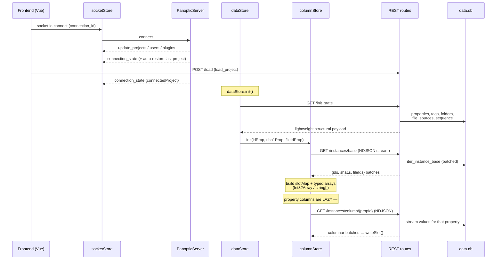
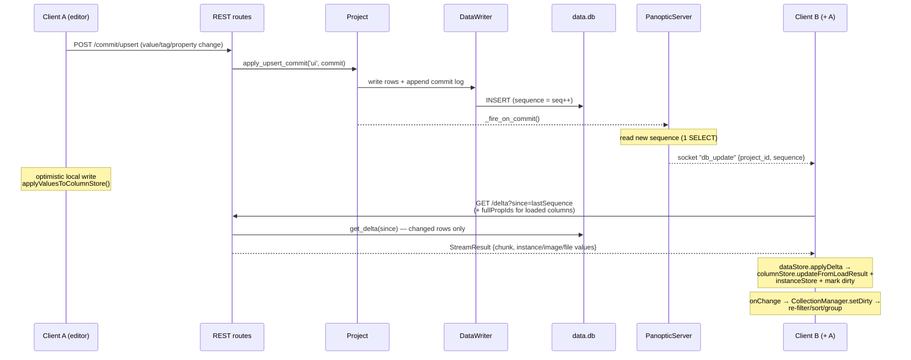
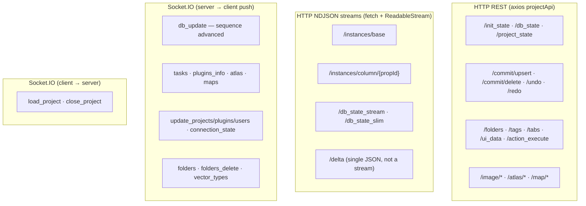

# Panoptic — Full Data Flow

A visualization of how data moves through Panoptic, in every direction: from files on
disk → backend databases → HTTP/WebSocket → frontend stores → the view pipeline → the UI,
and back again on every edit. Diagrams are Mermaid (render in GitHub / VS Code / most
markdown viewers).

---

## 1. System overview



**Four data stores per project** (plus one global registry):

| Store | Owner | Holds |
|-------|-------|-------|
| `panoptic.db` (global, `~/.panoptic/`) | `PanopticDB` | project registry, installed plugins, users |
| `project.db` | `ProjectDB` | project config/id, **ID allocators**, tabs, per-user UI state |
| `data.db` | `DataReader` / `DataWriter` | properties, tags, instances, files, folders, file_sources, **all property values**, the **commit log**, and the monotonic **sequence** |
| `media.db` | `MediaDB` | thumbnail **blobs**, vectors, atlases, maps, image_types |
| filesystem | — | original images, `atlas/*.png` sheets, plugin code |

---

## 2. Ingestion — files → databases (write-in)

How raw image files on disk become queryable instances + thumbnails.



Key points:
- **sha1 is the content identity.** A `File` (a path) and an `Instance` (a row in a view)
  both reference a sha1; thumbnails, vectors, and values can be keyed per-instance,
  per-sha1, or per-file.
- Structural inserts (`files`, `instances`) **bump the sequence** but are *not* in the
  revertable commit log — they're hard-deleted, never undone.
- Progress and completion stream to the UI live over the `tasks` / `atlas` socket events.

---

## 3. Initial project load — backend → frontend

What happens when a project is opened, filling the in-memory columnar engine.



- `/init_state` returns only **structure** (properties, tags, folders, sequence) — fast even
  on huge projects.
- `/instances/base` streams the **identity columns** (`id`, `sha1`, `file_id`) as NDJSON,
  building `columnStore.slotMap` (instanceId → slot index) and parallel typed arrays.
- **Value columns are loaded on demand**: `columnStore.requireFullColumn(propId)` streams
  `/instances/column/{propId}` only when a property is filtered/sorted/grouped/displayed.
- `lastSequence` is captured here — it's the cursor for all future delta syncs.

---

## 4. Real-time sync — an edit propagates to every client

The core loop. Every write bumps a sequence; clients pull just the delta since their cursor.



Two redundant change-detection paths feed the same `db_update` broadcast:
- **Push (default):** `Project._fire_on_commit` runs right after a write commits.
- **Poll (opt-in, `WATCH_PANOPTIC_DB=1`):** `DbWatcher` reads the sequence every 100 ms —
  catches writes made by plugins/tasks/other processes.

Delta merge rules in `dataStore.applyDelta`:
- Value upserts/deletes → `columnStore.writeSlot` / `markSlotDeleted` for matching slots.
- Tag/property/group structural changes → `applyCommit` updates `properties`/`tags` indices.
- **Structural instance deletes are NOT delta-synced** — the route returns `reload:true`
  and the frontend does a full `location.reload()` (a partial delta would corrupt slots).

---

## 5. The view pipeline — columnStore → screen

How filtered/sorted/grouped results are computed without ever allocating Instance objects.

```mermaid
flowchart LR
    subgraph COL["columnStore (raw, non-reactive)"]
        SLOTS["slotMap + typed arrays<br/>+ deletedMask + selectionMask"]
        CD["columnData[propId]<br/>numeric / bool / string / tag(CSR)"]
    end

    subgraph TAB["TabManager (per tab)"]
        TS["TabState: collections[] + views[]"]
        CM["CollectionManager<br/>(one per collectionId)"]
    end

    subgraph PIPE["Pipeline (operates on Int32Array of slots)"]
        F["FilterManager.filter()"]
        S["SortManager.sort()"]
        G["GroupManager.group()"]
    end

    VIEWS["Views<br/>tree · grid · map · graph"]

    SLOTS --> F
    CD --> F
    TS --> CM
    CM --> F --> S --> G --> VIEWS

    DSCHANGE["dataStore.onChange<br/>(dirty instances)"] -->|setDirty| CM
    STATEW["watch: filter/sort/group state"] -->|requestReload<br/>(coalesced, debounced)| CM
    COLREADY["watch: columnStore.isReady"] -->|update| CM
    VIEWS -->|select / edit| DSCHANGE
```

- A **`CollectionManager`** wires `Filter → Sort → Group`, all working on `Int32Array` slot
  indices — fast, allocation-free. Two views can **share** one collection (one computation)
  or **unbind** to diverge.
- Recompute is triggered by three reactive sources: data changes (`onChange`), config
  changes (deep `watch` on filter/sort/group state → debounced, coalesced to the most
  expensive pending kind), and column-load completion (`isReady`).
- Selection lives as a slot-indexed `selectionMask` in `columnStore`; a `selectionVersion`
  ref keeps the 1M-slot mask out of Vue reactivity while still letting templates re-render.

---

## 6. Image bytes & media serving

```mermaid
flowchart LR
    V["View / "] -->|GET /image/by_size/{sha1}?size=N| IR["project_routes"]
    IR --> GB["Project.get_best_image_bytes(sha1, size)"]
    GB -->|pick smallest thumb ≥ N| MEDIA[("media.db blobs")]
    GB -. miss .-> RAW["/image/raw/{sha1}"]
    RAW --> RES["resolve_image_ref"]
    RES -->|local| FILE["original file on disk"]
    RES -->|iiif| PROXY["httpx proxy → remote IIIF host"]
    MAP["map view"] -->|GET /atlas/{id}<br/>/atlas_sheet/{id}/{n}| ATL["atlas/*.png"]
```

Thumbnails are served from `media.db` blobs by best-fit size; on a miss it falls back to the
original file, or proxies a remote **IIIF** URL (with a browser UA to dodge 403s), or the
largest cached thumbnail. Map/atlas views pull pre-rendered PNG sheets.

---

## 7. Channel summary — who talks how



| Concern | Channel | Direction |
|---------|---------|-----------|
| Bulk initial load | NDJSON streams | back → front |
| Per-property values (lazy) | NDJSON stream | back → front |
| Incremental sync | `db_update` (WS) → `/delta` (HTTP) | back → front |
| Mutations (edits, tags, props) | REST POST commits | front → back |
| Live progress (tasks, atlas) | Socket.IO push | back → front |
| Project/user/plugin registry | REST + Socket.IO push | both |
| Image bytes | REST | back → front |

---

### Cross-references (code anchors)

- Backend compose / channels: `panoptic_back/panoptic/main.py`
- Socket events + broadcasts: `core/server/panoptic_server.py`
- REST surface: `routes/panoptic_routes.py`, `routes/project_routes.py`
- Read/write facade: `core/project/project.py`, `core/databases/data/{data_reader,data_writer}.py`
- Sequence poll: `core/watcher/db_watcher.py`
- Ingestion / atlas: `core/task/{import_folder_task,generate_atlas_task,task_manager}.py`
- Plugin sandbox: `core/plugin/plugin_interface.py`
- Frontend API: `src/data/apiProjectRoutes.ts`
- Realtime client: `src/data/socketStore.ts`
- Orchestrator: `src/data/dataStore.ts`
- Columnar engine: `src/data/columnStore.ts`
- View pipeline: `src/core/{TabManager,CollectionManager,FilterManager,SortManager,GroupManager}.ts`
```
